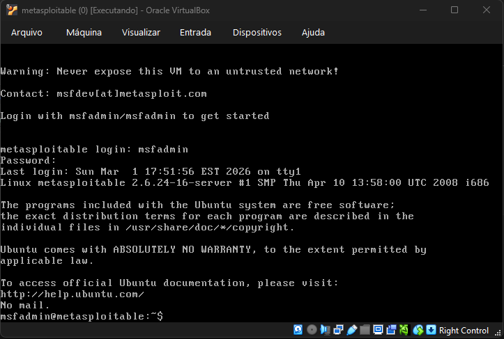

# Metasploitable
Máquinas virtuais intencionalmente vulneráveis para prática de testes de penetração e treinamento em segurança.

[**EN-US**](../README.md)

## 📦 Dependências
- [Oracle VirtualBox](https://www.virtualbox.org/) — Plataforma de virtualização;
- **Metasploitable 1** — Não está mais oficialmente disponível; requer busca em espelhos arquivados ou backups existentes.
- [Metasploitable 2](https://sourceforge.net/projects/metasploitable/files/Metasploitable2/) — Download oficial do SourceForge.
- [Metasploitable 3](https://github.com/rapid7/metasploitable3) — Repositório oficial no GitHub (requer build com Vagrant/Packer).

## 📋 Versões Disponíveis

  
Informações das Versões

  **Metasploitable 1:**
  - Primeira geração com serviços vulneráveis básicos
  - Baseado em Ubuntu 8.04
  - Não está mais oficialmente disponível

  **Metasploitable 2:**
  - Versão aprimorada com vulnerabilidades adicionais
  - Baseado em Ubuntu 8.04
  - Mais serviços e configurações incorretas
  - Oficialmente disponível

## 🚀 Primeiros Passos

  
Credenciais Padrão

  - **Usuário:** msfadmin
  - **Senha:** msfadmin
  > 💡**Observação:** As versões 1 e 2 compartilham as credenciais: msfadmin/msfadmin. Essas credenciais são intencionalmente fracas para fins de treinamento.

  
Configuração de Rede

  Nas configuração de rede de cada Máquina Virtual, adicione uma Placa de Interface de Rede (NIC):
  1. **Adaptador 1** — LAN (Rede Interna - homelab).

  > 💡**Observação:** Estas máquinas intencionalmente vulneráveis nunca devem ser expostas a uma rede não confiável.

